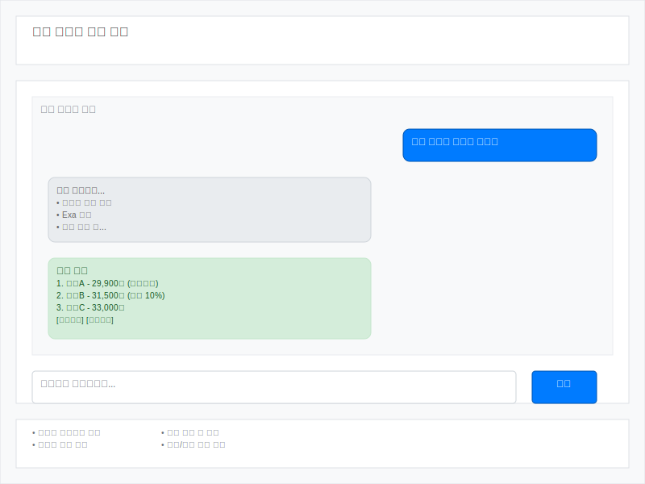

# UX 와이어프레임

## UX 와이어프레임

### 웹 챗봇 인터페이스 와이어프레임

#### 주요 구성 요소:

1. **헤더 영역**: 서비스 제목 표시
2. **채팅 메시지 영역**: 
   - 사용자 메시지 (우측 정렬, 파란색)
   - 봇 응답 메시지 (좌측 정렬, 회색)
   - 실시간 스트리밍 상태 표시
   - 검색 결과 리스트 (녹색 배경)
3. **입력 영역**: 
   - 텍스트 입력 필드
   - 전송 버튼
4. **기능 표시 영역**: 
   - 실시간 스트리밍 응답
   - 멀티턴 대화 지원
   - 가격 비교 및 정렬
   - 할인/배송 정보 포함 